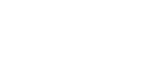

# project klein



2D side-scroller platformer game prototype using 2D ray-traced portals to create 
confusing, non-eucledian worlds

This project has been inspired significantly by
[AAAAXY](https://divverent.github.io/aaaaxy/) (by [divVerent](https://github.com/divVerent))

Made as an intake assignment for BUas.

## Cloning and building

Important: If you obtained this source repository by manually cloning it with `git`,
make sure to initialize the git submodules first:

```bash
git submodule update --init --recursive
```

### Windows build instructions

On Windows, both Visual Studio and CMake are supported:

### Windows build instructions (Visual Studio)

Open the `klein.slnx` solution in Visual Studio.  \
The build has been verified on latest version of VS2026 Enterprise.

### Windows build instructions (CMake)

Use CMakeLists.txt/CMakeSettings.json provided with the project.

- Make sure to select `klein.exe` as the build target.
- Make sure you have `git` installed in your `PATH` (system-wide) on your host machine,\
  it is required to configure the project (and is not a core part of VS2026)\
  (to quickly install it, run `winget install Git.Git`)

### Linux build instructions (CMake)

On Linux, this project can be built using Nix and CMake:

```bash
nix develop # or, use direnv: direnv allow
cmake -B build -G Ninja
ninja -C build
```

(Default configuration is `Debug`; to build in release mode pass
`-DCMAKE_BUILD_TYPE=RelWithDebInfo` to the `cmake` command)

## Gameplay and controls

Only keyboard input is supported, the controls are fairly basic:

- Movement: either WASD/Arrow keys to move.
- Jump: Either Space or Up on movement keys.

This game uses ray-casting-based portals to mess with your perception of the world.

Explore the confusing non-eucledian world and try to find the exit.

### Debug menu

Debug menu can be used to visualize rendering internals.
(It is only available if the game is built in debug mode/profile.)

## License

All code under src/ is licensed under the terms of the PolyForm Non-Commercial License,\
Go to [LICENSE.md](LICENSE.md) for more details.

Some assets might be licensed under different terms.

### Third-party Asset Licenses/Attribution

NOTE: This is also available in CREDITS.md in this repository and release builds.

- **KMR Editor Icon Set** by komorra\
  License: [CC-BY 3.0](https://creativecommons.org/licenses/by/3.0/)

- **Free Prototype 2D Platformer 32×32 Pixel Tileset**\
  Source: <https://craftpix.net/freebies/free-prototype-2d-platformer-32x32-pixel-tileset/>\
  License: <https://craftpix.net/file-licenses/>

- **Free Pixel Art Prototype Character Sprites**\
  Source: <https://craftpix.net/freebies/free-pixel-art-prototype-character-sprites/>\
  License: <https://craftpix.net/file-licenses/>

## Note

No AI/LLM agents, generated code or documentation has been *directly* used for
this project (and no such contributions will be made/accepted in the future)

(I have used Copilot auto-complete and LLM(s) to assist in debugging
during development though.)
